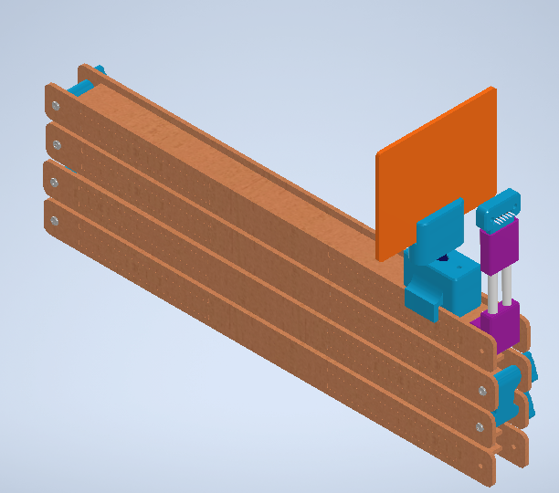
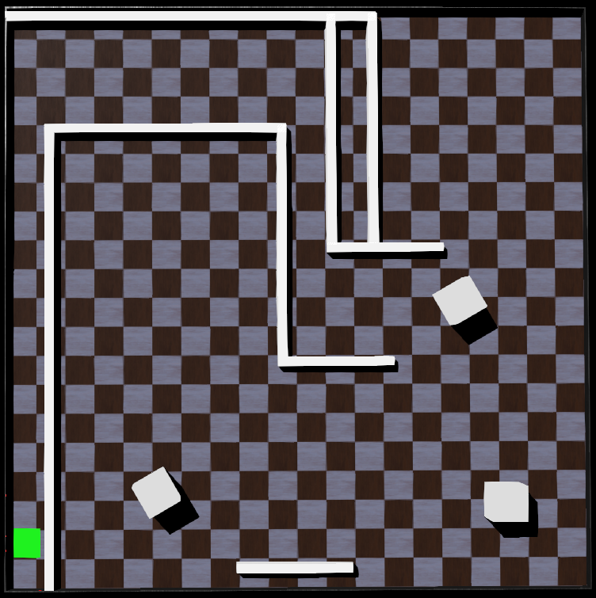
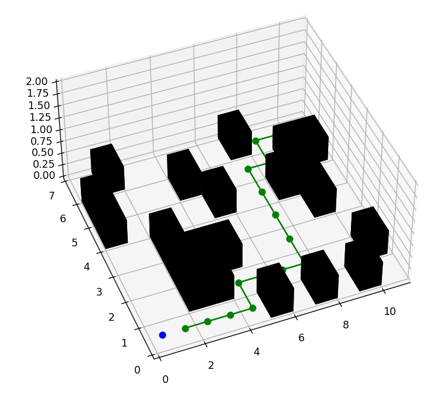

# Desarrollo y evaluación de algoritmos para el mapeo de entornos y generación de trayectorias utilizando sistemas robóticos multi-agente

Este trabajo de investigación se enfocó en la creación y combinación de tres algoritmos
principales relacionados con la navegación autónoma de vehículos de tracción diferencial.
Los tres algoritmos principales de este estudio comprendieron la exploración de entornos, el
mapeo en dos dimensiones de los entornos y la generación óptima de trayectorias. Estos algoritmos
fueron específicamente diseñados y adaptados para su implementación en vehículos
móviles de tracción diferencial.
La motivación principal detrás de esta investigación es la necesidad de comprender cómo
un vehículo de tracción diferencial puede interactuar de manera efectiva en un entorno
desconocido. Se asumió que el vehículo está equipado únicamente con sensores de distancia
colocados estratégicamente en posiciones específicas, sensores para determinar la posición
de las ruedas y una brújula. Además, se consideró un sistema de posicionamiento respecto a
entorno de simulación para el vehículo, únicamente con el propósito de comparar y validar
la posición estimada.
Para lograr que el vehículo interactuara con éxito en su entorno, se realizaron diferentes
iteraciones de los tres algoritmos principales utilizando dos tipos diferentes de sensores de
distancia en el vehículo. Los resultados de estas iteraciones permitieron determinar la opción
óptima de sensor de distancia para aplicar en los algoritmos desarrollados.
La validación de los algoritmos desarrollados se llevó a cabo mediante simulaciones
computarizadas, en un entorno que comprende entornos con diferentes características. Durante
este proceso, se evaluó la precisión de los algoritmos, teniendo en cuenta factores como
el tiempo de simulación y la posición inicial del vehículo. Estas pruebas proporcionaron una
comprensión más profunda de cómo los algoritmos se desempeñan en condiciones diversas y
cómo pueden optimizarse para aplicaciones prácticas en la navegación autónoma de vehículos
de tracción diferencial.

## Estructura del Repositorio

El repositorio está organizado en las siguientes carpetas:

1. **Base pruebas sensores**: Contiene el diseño físico de la base utilizada para validar los valores de lectura de los sensores de distancia.

   

2. **prototipo**: Contiene algoritmos relacionados con el mapeo, generación de trayectorias, etc.

   

3. **webots**: Contiene el mundo para la simulación de algoritmos de exploración, mapeo y generación de trayectorias en Webots.

   

